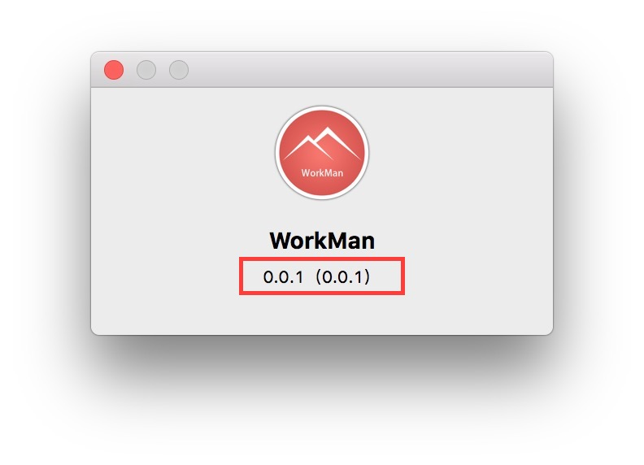

# Electron Info.plist设置



修改上图红框中版本信息.

打开打包后的内容,找到 __info.plist__ 文件.
 
CFBundleVersion 显示的为 红框()内内容.

```xml
	<!-- App store 版本 -->
	<key>CFBundleShortVersionString</key>
    <string>0.0.1</string>
    <!-- 开发版本号 -->
    <key>CFBundleVersion</key>
    <string>0.0.1</string>
    <!-- 版权说明 -->
    <key>NSHumanReadableCopyright</key>
    <string>© 2016 ektx. All rights reserved.</string>
```


